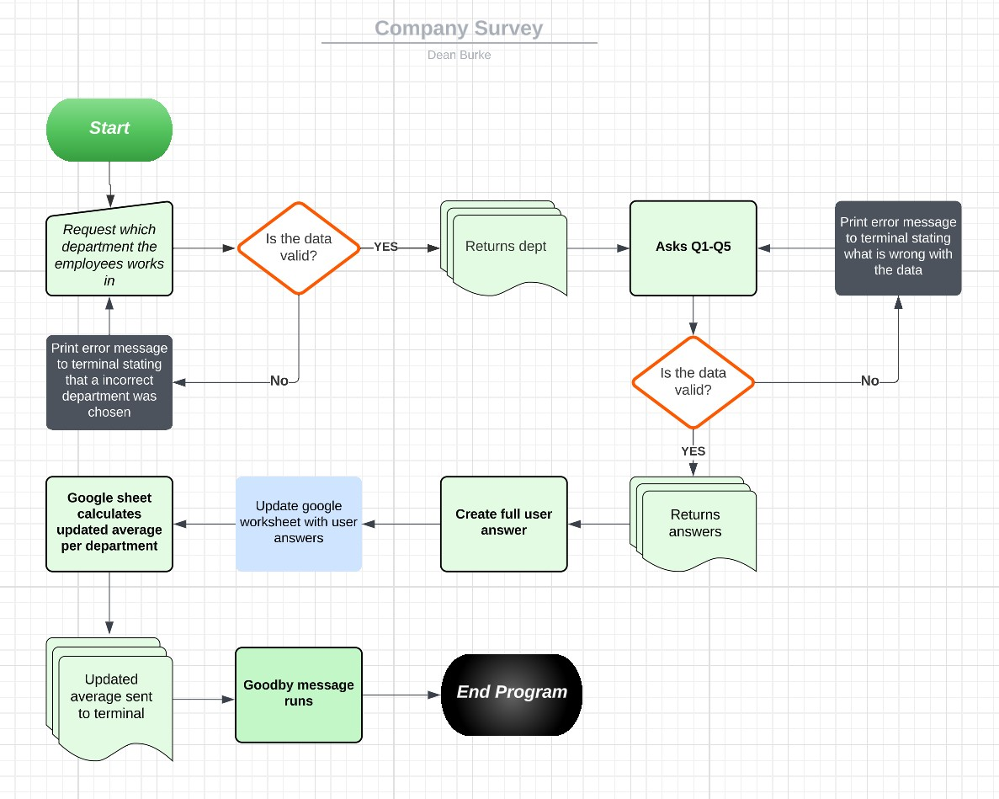

# Company Survey

[View the live project here.](https://company-survey.herokuapp.com/)

Welcome to our company survey! We are excited to hear your feedback and opinions on your experience at our company. Your responses will help us to better understand how we can improve our workplace and make it a better environment for employess.

This survey will ask you a series of questions related to various aspects of your experience with the company. Please make sure to read each question carefully and to select the answr that best reflects your experience. 

Thank you in advance for taking the time to complete this survey. Your feedback is greatly appreciated and will help us make positive changes within the company.

---

# Program intended use

The Python program developed is designed to gather valuable feedback from employees.

The program begins by asking employees to input their department, and then asks them five questions that require a rating between 1 and 5.