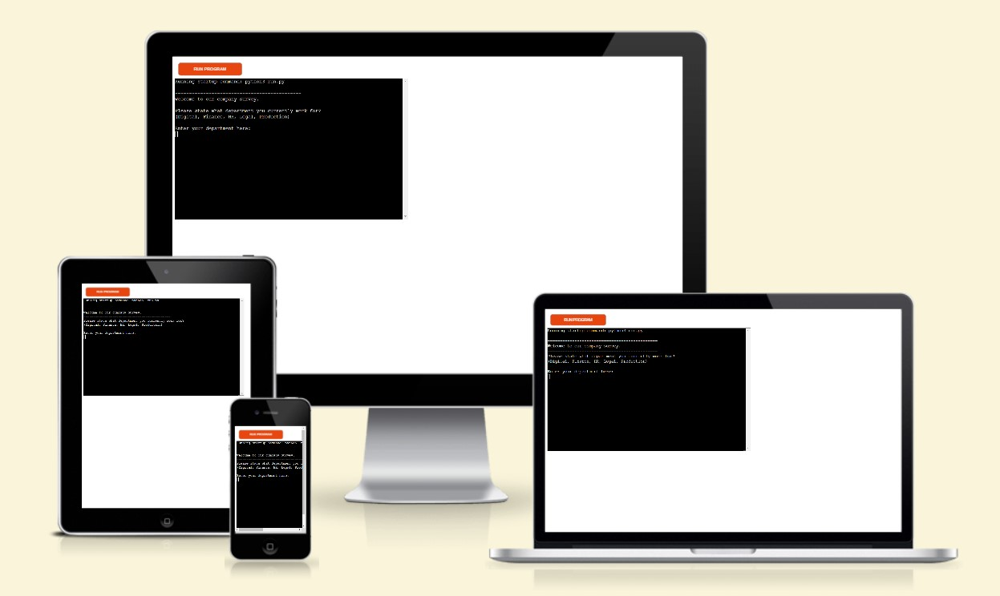

# Company Survey

[View the live project here.](https://company-survey.herokuapp.com/)

Welcome to our company survey! We are excited to hear your feedback and opinions on your experience at our company. Your responses will help us to better understand how we can improve our workplace and make it a better environment for employess.

This survey will ask you a series of questions related to various aspects of your experience with the company. Please make sure to read each question carefully and to select the answr that best reflects your experience. 

Thank you in advance for taking the time to complete this survey. Your feedback is greatly appreciated and will help us make positive changes within the company.

---

# Program intended use

The Python program developed is designed to gather valuable feedback from employees.

The program begins by asking employees to input their department, and then asks them five questions that require a rating between 1 and 5. Once employees have submitted their responses, the program automatically pushes the information to a Google Sheet, where the responses are compiled and averaged per department on a separate sheet.

This updated average is sent back to the terminal, to give employees an up to date rating per department before the deadline is finished and the results will be announced. 

# Features

* The program will only allow the employee to select from a select number of departments.
    * An error message is returned if the employee tries to input incorrect department, or misspells one the departments that is an option.
    * It won't matter if the employee uses any capital letters, the program will accept the entry once it is spelt correctly.
    * It will loop until a correct option is enterend.
* The program then asks the five questions, it will only accept an answer between 1 and 5.
    * It will raise a ValueError and display a message to the terminal if the employee tries to enter a number higher, more than one digit/character or is a letter.
    *  It will loop until a correct option is enterend.
* The program then creates a user submission string (converting the answers into integers) and pushes it to the Google Sheet.
* The program then pulls the updated information from the 'average' tab on the Google Sheet and calls it to the terminal. 
* Goodbye message then runs and program ends. 

## Future Features

* Add an additional question where the employee can give additional feedback and it will be collated into separate tabs per department. 
* Give the employee a chance to review their answers before submitting, allowing them to restart their questionnaire to change an answer if needed. 
* Add a name entry question, which won't be attached to their answers (to keep their anonymity), but will be added to a separate tab to track if all employees have submitted a response.
* Possibly change how the average tab is collating the updated result average per department (use Python code)
    * Currently it updates due to a Google Sheet (Excel) formula.

# Testing

* I have manually tested all code throughout, to clear any error messages as they were occurring (mainly whitespaces / indentation).
* Passed my code through the [PEP8 checker](https://pep8ci.herokuapp.com/) created by Code Institute, no errors found as per image below

# Bugs

## Solved Bugs

When creating the "validate_dept" function, it was constantly giving an error message, I incorrectly had (values) in the parameter, which I then correcte to (dept).

Another bug that arose was when the user submission was pushed to the Google Sheet, the answers were incorrectly not being inputted as integers, I used int() when declaring the variable to resolve this.

## Unfixed Bugs

No unfixed bugs.

# Validating Testing

The code was ran through PEP8 as mentioned above with no errors showing. 

# Deployment

This project was deployed to Heroku. Steps below.

* Make sure your requirement.txt file is updated by entering "pip3 freeze > requirements.txt" into the terminal.

    

* Create a new Heroku app.

    

* Create the config vars (creds file) and the needed buildpacks (Python and NodeJS).

    

* Link Github to Heroku for deployment and click on Deploy Branch once the respository is selected. 

    

# Credits

* Code from the Love Sandwiches project was helpful throughout this project and on deployment.
* I used to the following [topic/article](https://stackoverflow.com/questions/31625792/python-how-to-accept-only-certain-words-with-user-input) from Stack Overflow to help with only allowing a particular word being entered for my department selection code.
* When creating the function to pull the updated averages to the terminal, I used this [article](https://docs.gspread.org/en/latest/user-guide.html) from [gspread](https://docs.gspread.org/en/latest/index.html)